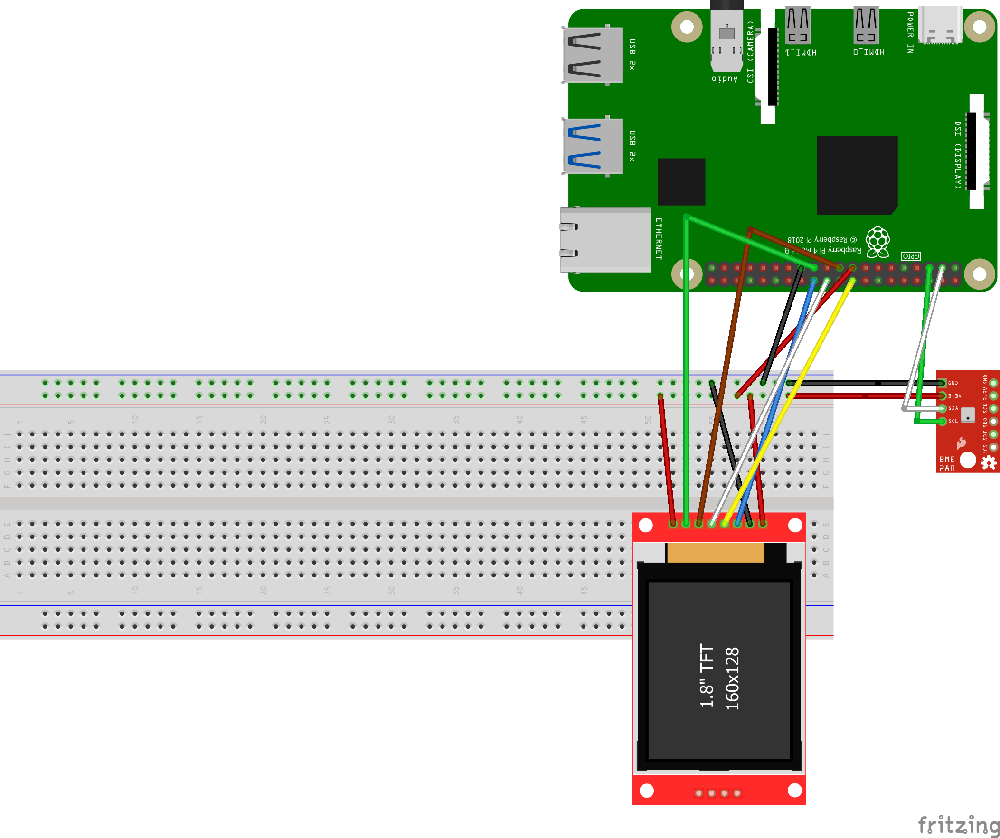
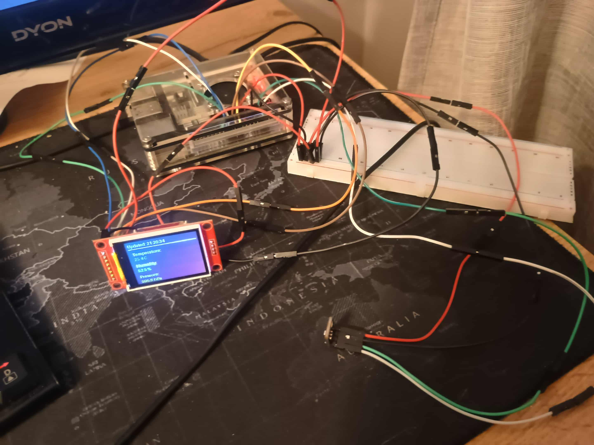
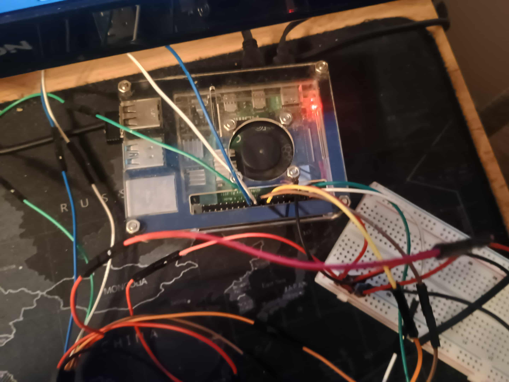

# 🌦️ Weather Station – Projekt zaliczeniowy z TMISW

**Autor:** Mateusz Bogacz-Drewniak  
**Email:** mateusz.bogacz-drewniak@studenci.collegiumwitelona.pl  
**GitHub:** [mateusz-bogacz-collegiumwitelona](https://github.com/mateusz-bogacz-collegiumwitelona)  
**Wersja:** 1.1 (ostatnia aktualizacja: 2025-11-17)

---

## 📋 O projekcie

Stacja pogodowa oparta na **Raspberry Pi** z czujnikiem **BME280** i wyświetlaczem **ST7735**. Projekt wykonany na zaliczenie przedmiotu _"Techniki mikroprocesorowe i systemy wbudowane"_.

### Architektura systemu

System składa się z trzech głównych komponentów:

- **Backend** (FastAPI + Python) – odczyt danych z czujnika BME280 przez I2C, REST API, zapis do bazy SQLite
- **Frontend** (Svelte + TailwindCSS) – responsywny dashboard z wizualizacją danych w czasie rzeczywistym
- **Display** (ST7735) – wyświetlanie aktualnych pomiarów na kolorowym ekranie LCD (160x128 px, SPI)

### ✨ Funkcjonalności

- 🌡️ **Pomiar w czasie rzeczywistym** – temperatura (°C), wilgotność (%), ciśnienie atmosferyczne (hPa)
- 📊 **Historia pomiarów** – przeglądanie wszystkich zapisanych danych w tabeli
- 🖥️ **Dashboard webowy** – dostępny z przeglądarki w sieci lokalnej przez mDNS
- 📱 **Responsywny interfejs** – działa na komputerach, tabletach i telefonach
- 🔄 **Automatyczne odświeżanie** – dane aktualizują się co 60 sekund
- 💾 **Baza danych SQLite** – przechowywanie historii wszystkich pomiarów
- 🎨 **Kolorowy wyświetlacz LCD** – dynamiczne kolory w zależności od wartości pomiarów
- 🔌 **REST API** – endpointy do pobierania bieżących danych i historii
- ⚡ **Systemd integration** – automatyczne uruchamianie przy starcie systemu

---

## 🛠️ Wymagania

### Sprzętowe

- **Raspberry Pi** z systemem Raspberry Pi OS (testowane na RPi 4B 4GB)
- Czujnik **BME280** (protokół I2C)
- Wyświetlacz **ST7735** (128x160 pikseli, protokół SPI)
- Kable połączeniowe (żeńsko-męskie)
- Płytka prototypowa (opcjonalnie)

### Programowe

- **Git** (do sklonowania repozytorium)
- Pozostałe zależności zostaną automatycznie zainstalowane przez skrypt `setup.sh`:
  - Python 3.x + pip
  - Node.js + npm
  - Biblioteki Python (FastAPI, SQLAlchemy, uvicorn, Adafruit, i inne)
  - Avahi (mDNS) dla dostępu przez `weatherstation.local`

---

## 🔌 Schemat połączeń

### BME280 → Raspberry Pi (I2C)

| Raspberry Pi GPIO | BME280    |
| ----------------- | --------- |
| Pin 17 (3.3V)     | Vin       |
| Pin 6 (GND)       | GND       |
| Pin 3 (SDA)       | SDA (SDI) |
| Pin 5 (SCL)       | SCL (SCK) |

### ST7735 → Raspberry Pi (SPI)

| Raspberry Pi GPIO | ST7735 Pin |
| ----------------- | ---------- |
| Pin 1 (3.3V)      | VCC        |
| Pin 6 (GND)       | GND        |
| Pin 24 (GPIO 8)   | CS         |
| Pin 18 (GPIO 24)  | RESET      |
| Pin 22 (GPIO 25)  | A0/DC      |
| Pin 19 (GPIO 10)  | SDA        |
| Pin 23 (GPIO 11)  | SCK        |
| Pin 17 (3.3V)     | LED        |

### Schemat graficzny



---

## 📦 Instalacja

### 1. Zainstaluj Git (jeśli nie masz)

```bash
sudo apt install git -y
```

### 2. Sklonuj repozytorium

```bash
git clone https://github.com/mateusz-bogacz-collegiumwitelona/weather_Station
cd weather_Station
```

### 3. Uruchom skrypt instalacyjny

```bash
chmod +x ./setup.sh
./setup.sh
```

### Co robi skrypt instalacyjny?

Skrypt `setup.sh` automatycznie:

1. ✅ Instaluje zależności systemowe (Python, Node.js, npm, Avahi)
2. ✅ Włącza interfejsy I2C i SPI
3. ✅ Konfiguruje mDNS (dostęp przez `weatherstation.local`)
4. ✅ Instaluje zależności Python z `requirements.txt`
5. ✅ Instaluje zależności npm i buduje frontend
6. ✅ Inicjalizuje bazę danych SQLite
7. ✅ Tworzy usługi systemd dla backendu i frontendu
8. ✅ Uruchamia aplikację

Po zakończeniu instalacji system będzie automatycznie uruchamiał się przy każdym restarcie Raspberry Pi.

---

## 🌐 Dostęp do aplikacji

Po uruchomieniu aplikacja jest dostępna pod adresami:

### Frontend (Dashboard)

- `http://weatherstation.local:5173` (przez mDNS)
- `http://<IP_RASPBERRY_PI>:5173`

### Backend (REST API)

- `http://weatherstation.local:8000` (przez mDNS)
- `http://<IP_RASPBERRY_PI>:8000`

### Dokumentacja API

- `http://weatherstation.local:8000/docs` (Swagger UI)

---

## 🔗 Endpointy API

### `GET /`

Pobiera aktualne dane pogodowe (ostatni odczyt z czujnika).

**Przykład:**

```bash
curl http://weatherstation.local:8000/
```

**Odpowiedź:**

```json
{
  "temperature": 22.5,
  "humidity": 45.2,
  "pressure": 1013.25,
  "timestamp": "2025-11-18T14:30:00"
}
```

### `GET /history`

Pobiera całą historię pomiarów (wszystkie rekordy z bazy).

**Przykład:**

```bash
curl http://weatherstation.local:8000/history
```

**Odpowiedź:**

```json
[
  {
    "temperature": 22.5,
    "humidity": 45.2,
    "pressure": 1013.25,
    "timestamp": "2025-11-18T14:30:00"
  },
  {
    "temperature": 22.3,
    "humidity": 44.8,
    "pressure": 1013.2,
    "timestamp": "2025-11-18T14:29:00"
  }
]
```

---

## 🖥️ Zarządzanie systemem

### Sprawdzenie statusu usług

```bash
sudo systemctl status weather-backend
sudo systemctl status weather-frontend
```

### Przeglądanie logów

```bash
# Logi backendu (na żywo)
sudo journalctl -u weather-backend -f

# Logi frontendu (na żywo)
sudo journalctl -u weather-frontend -f

# Ostatnie 50 linii logów
sudo journalctl -u weather-backend -n 50
```

### Restart usług

```bash
sudo systemctl restart weather-backend
sudo systemctl restart weather-frontend
```

### Zatrzymanie usług

```bash
sudo systemctl stop weather-backend weather-frontend
```

### Uruchomienie usług

```bash
sudo systemctl start weather-backend weather-frontend
```

### Wyłączenie automatycznego startu

```bash
sudo systemctl disable weather-backend
sudo systemctl disable weather-frontend
```

---

## 🧪 Testowanie sprzętu

### Test czujnika BME280

```bash
# Sprawdź czy czujnik jest wykrywany przez I2C
i2cdetect -y 1

# Uruchom skrypt testowy
python3 bme280_test.py
```

Oczekiwany adres BME280: `0x76` lub `0x77`

### Test wyświetlacza ST7735

```bash
python3 st7735_test.py
```

Skrypt wyświetli serię kolorów i tekstu na ekranie.

---

## 📸 Zdjęcia projektu





---

## 🔧 Rozwiązywanie problemów

### Problem: Wyświetlacz ST7735 nie działa

**Rozwiązanie:**

1. Sprawdź czy SPI jest włączone:

   ```bash
   sudo raspi-config
   # Interface Options → SPI → Enable
   ```

2. Zweryfikuj połączenia zgodnie z tabelą pinout

3. Sprawdź czy biblioteki są zainstalowane:

   ```bash
   pip3 list | grep adafruit
   ```

4. Uruchom test:
   ```bash
   python3 st7735_test.py
   ```

### Problem: Czujnik BME280 nie jest wykrywany

**Rozwiązanie:**

1. Sprawdź czy I2C jest włączone:

   ```bash
   sudo raspi-config
   # Interface Options → I2C → Enable
   ```

2. Zweryfikuj połączenia I2C (szczególnie SDA i SCL)

3. Sprawdź adres czujnika:

   ```bash
   i2cdetect -y 1
   ```

   Powinieneś zobaczyć `76` lub `77` w tabeli

4. Uruchom test:
   ```bash
   python3 bme280_test.py
   ```

### Problem: Backend nie startuje

**Rozwiązanie:**

1. Sprawdź logi:

   ```bash
   sudo journalctl -u weather-backend -n 100
   ```

2. Sprawdź czy wszystkie zależności są zainstalowane:

   ```bash
   pip3 install -r backend/requirements.txt
   ```

3. Sprawdź czy baza danych została utworzona:
   ```bash
   ls -la weather_data.db
   ```

### Problem: Frontend nie wyświetla danych

**Rozwiązanie:**

1. Sprawdź czy backend działa:

   ```bash
   curl http://localhost:8000/
   ```

2. Sprawdź logi frontendu:

   ```bash
   sudo journalctl -u weather-frontend -n 50
   ```

3. Sprawdź konfigurację CORS w `main.py`

### Problem: Nie mogę połączyć się przez `weatherstation.local`

**Rozwiązanie:**

1. Sprawdź czy Avahi działa:

   ```bash
   sudo systemctl status avahi-daemon
   ```

2. Sprawdź hostname:

   ```bash
   hostname
   ```

3. Zrestartuj Avahi:

   ```bash
   sudo systemctl restart avahi-daemon
   ```

4. Użyj bezpośrednio adresu IP:
   ```bash
   hostname -I
   ```

---

## 📚 Stack technologiczny

### Backend

- **FastAPI** – nowoczesny framework do tworzenia API
- **SQLAlchemy** – ORM do obsługi bazy danych
- **Uvicorn** – ASGI server
- **SQLite** – lekka baza danych
- **smbus2** – komunikacja I2C z BME280
- **Adafruit CircuitPython** – biblioteki do obsługi wyświetlacza ST7735
- **Pillow** – generowanie grafiki na wyświetlacz

### Frontend

- **Svelte** – reaktywny framework JavaScript
- **TailwindCSS** – utility-first CSS framework
- **Vite** – szybki bundler i dev server
- **TypeScript** – typowany JavaScript
- **svelte-spa-router** – routing dla SPA

### Hardware

- **Raspberry Pi 4B 4GB** – komputer jednopłytkowy
- **BME280** – czujnik temperatury, wilgotności i ciśnienia (I2C)
- **ST7735** – kolorowy wyświetlacz LCD 160x128 (SPI)

---

## 📄 Licencja

Projekt stworzony na potrzeby edukacyjne (zaliczenie przedmiotu TMISW).  
Kod źródłowy dostępny publicznie na GitHub.

---

## 👤 Kontakt

**Mateusz Bogacz-Drewniak**  
📧 Email: mateusz.bogacz-drewniak@studenci.collegiumwitelona.pl  
🐙 GitHub: [mateusz-bogacz-collegiumwitelona](https://github.com/mateusz-bogacz-collegiumwitelona)

---

**Wersja:** 1.1  
**Ostatnia aktualizacja:** 18 listopada 2025
